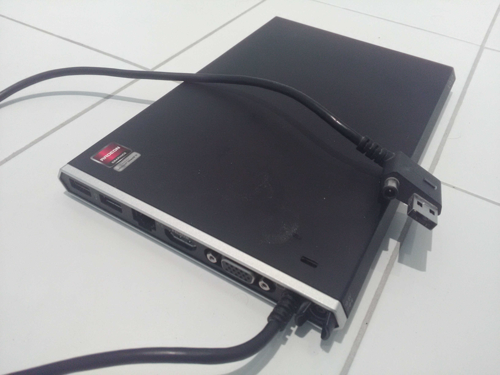
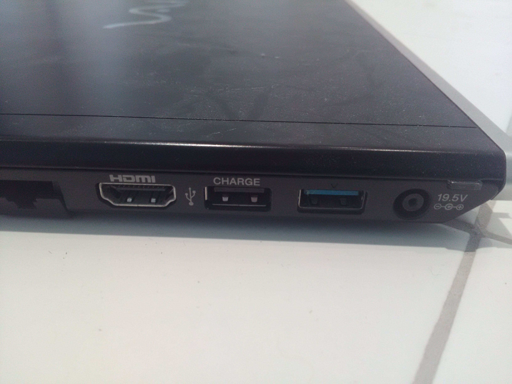
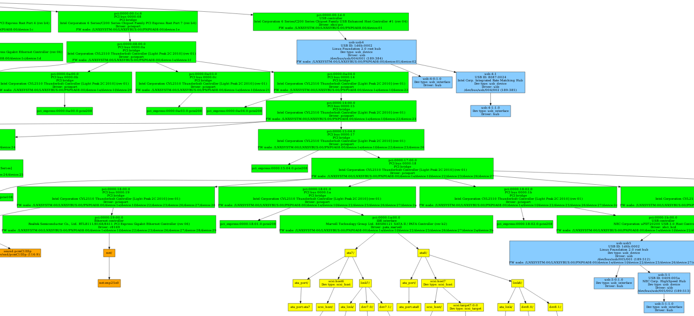
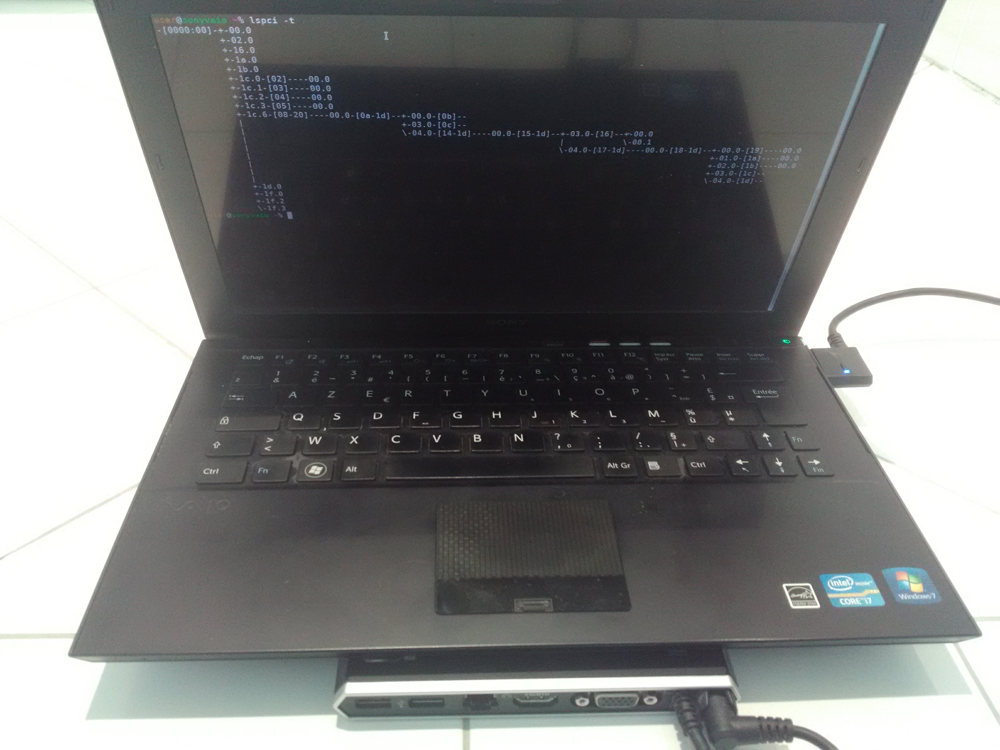

=====================================
Représenter l'arborescence matérielle
=====================================

:subtitle: ou comment faire « ``tree /sys/devices | graphviz`` » sur Linux
:author: Nicolas Iooss
:date: Rump SSTIC 2018

Rump
~~~~

Beaucoup d'outils
=================

.. role:: latex(raw)
   :format: latex

Énumérations :

* ``lspci`` (PCI)
* ``lsusb`` (USB)
* ``lsscsi`` (SCSI)
* ``lsblk`` (périphériques bloc)
* ``lstopo`` / ``hwloc-ls`` (cache CPU)
* ``lsmem`` (mémoire physique)
* ...

* ``lshw`` (matériel)

Association de périphérique
===========================

Où est branchée ma clé USB ?

* ``lsusb`` :latex:`$\Rightarrow$` ``/dev/bus/usb/001/002`` :latex:`$\Rightarrow$` ?
* ``/dev/sdc`` :latex:`$\Rightarrow$` ``/sys/class/block/sdc`` :latex:`$\Rightarrow$` ``/sys/devices/pci0000:00/0000:00:1a.0/usb1/...``

:latex:`\pause`

PCI ``00:1a.0`` ::

    USB controller:
    Intel Corporation 6 Series/C200 Series Chipset Family
    USB Enhanced Host Controller #2 (rev 04)

Quand c'est un peu plus complexe...
===================================

:latex:`\begin{center}`

:latex:`\end{center}`

Quand c'est un peu plus complexe...
===================================

:latex:`\begin{center}`

:latex:`\end{center}`

Quand c'est un peu plus complexe...
===================================

Où est l'interface ethernet ?

``lsusb`` n'aide pas trop ::

    +Bus 006 Device 001: ID 1d6b:0003 Linux Foundation 3.0 root hub
    +Bus 005 Device 002: ID 0409:005a NEC Corp. HighSpeed Hub
    +Bus 005 Device 001: ID 1d6b:0002 Linux Foundation 2.0 root hub

:latex:`\pause`

::

    /sys/class/net/enp25s0 -> ../../devices/pci0000:00/0000:00:1c.6/
    0000:08:00.0/0000:0a:04.0/0000:14:00.0/0000:15:04.0/0000:17:00.0/
    0000:18:00.0/0000:19:00.0/net/enp25s0

Quand c'est un peu plus complexe...
===================================

.. raw:: latex

    \makeatletter
    \newcommand{\verbatimfont}[1]{\renewcommand{\verbatim@font}{\ttfamily#1}}
    \makeatother
    \verbatimfont{\tiny}

``lspci -t`` déconnecté ::

    -[0000:00]-+-00.0
               +-02.0
               +-16.0
               +-1a.0
               +-1b.0
               +-1c.0-[02]----00.0
               +-1c.1-[03]----00.0
               +-1c.2-[04]----00.0
               +-1c.3-[05]----00.0
               +-1c.6-[08-20]--
               +-1d.0
               +-1f.0
               +-1f.2
               \-1f.3

Quand c'est un peu plus complexe...
===================================

.. raw:: latex

    \makeatletter
    \newcommand{\verbatimfont}[1]{\renewcommand{\verbatim@font}{\ttfamily#1}}
    \makeatother
    \verbatimfont{\tiny}

``lspci -t`` connecté ::

    -[0000:00]-+-00.0
               +-02.0
               +-16.0
               +-1a.0
               +-1b.0
               +-1c.0-[02]----00.0
               +-1c.1-[03]----00.0
               +-1c.2-[04]----00.0
               +-1c.3-[05]----00.0
               +-1c.6-[08-20]----00.0-[0a-1d]--+-00.0-[0b]--
               |                               +-03.0-[0c]--
               |                               \-04.0-[14-1d]----00.0-[15-1d]--+-03.0-[16]--+-00.0
               |                                                               |            \-00.1
               |                                                               \-04.0-[17-1d]----00.0-[18-1d]--+-00.0-[19]----00.0
               |                                                                                               +-01.0-[1a]----00.0
               |                                                                                               +-02.0-[1b]----00.0
               |                                                                                               +-03.0-[1c]--
               |                                                                                               \-04.0-[1d]--
               +-1d.0
               +-1f.0
               +-1f.2
               \-1f.3

Le problème
===========

Combiner ``lspci`` et ``lsusb`` de manière plus lisible que ``lshw`` ou ``tree /sys/devices``.

La solution
===========

Script Python :

* Extraire les informations du ``/sys``
* Compléter avec ``lspci``, ``lsusb``, ``ip addr``, etc.
* Générer un graphe

:latex:`$\Rightarrow$` https://github.com/fishilico/home-files/blob/master/bin/graph-hw

Sony Vaio « Light Peak » : Intel Corporation CVL2510 Thunderbolt Controller
===========================================================================

:latex:`\begin{center}`

:latex:`\end{center}`

Le script
=========

Autres fonctionnalités :

* Format SVG : recherche facile (``/dev/sdc``)
* Vue « circulaire » (``sfdp -Goverlap=prism``) possible
* Export/import JSON
* Filtrages sur les éléments (``/sys/devices/system/memory/``)

Conclusion
==========

https://github.com/fishilico/home-files/blob/master/bin/graph-hw

Évolutions possibles :

* Intégration avec d3js / Viz.js / OVALI
* Personnalisation de la palette de couleurs

Montage de quand c'est un peu plus complexe
===========================================

:latex:`\begin{center}`

:latex:`\end{center}`
